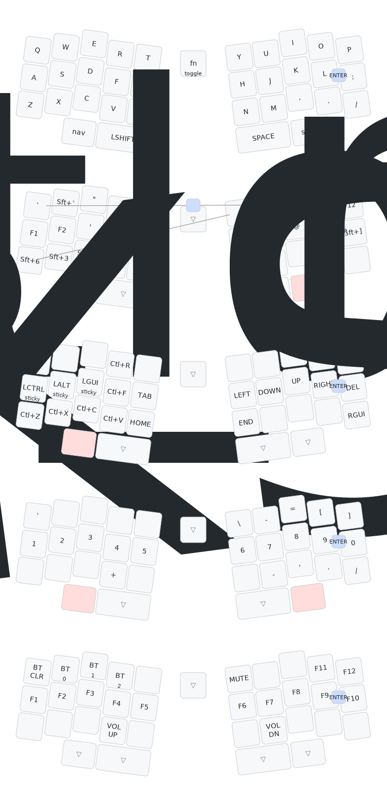

## ZMK Config for my Le Jlwffre Keyboard
This started out as a fork from [https://github.com/josh-l-wang/jlw-zmk-config](https://github.com/josh-l-wang/jlw-zmk-config) but has since evolved to be very much specific to my workflow.

